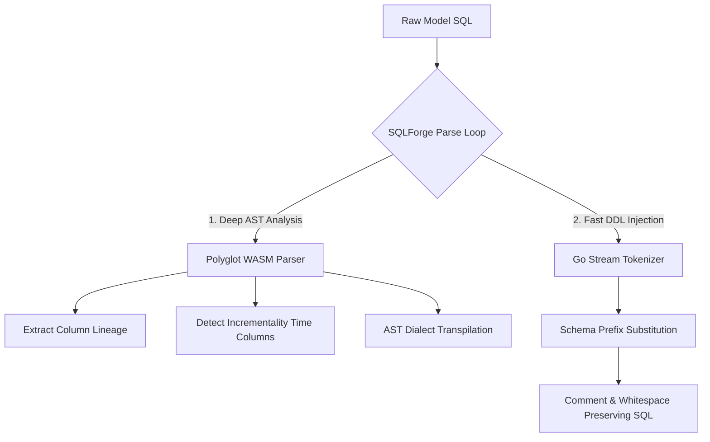

# Explanation: Tokenizer and Transpilation Architecture

SQLForge achieves robust, multi-dialect query compilation and high performance by using a hybrid parser engine. Instead of a single monolithic parser, it splits responsibilities between a **WebAssembly-compiled SQL Parser (Rust AST engine)** and a **Go Stream Tokenizer**. 

This document explains the technical rationale, benefits, and flow of this hybrid design.

---

## The Core Design Philosophy

Traditional SQL orchestration tools (like dbt) rely on Jinja templating. This forces developers to write non-standard SQL (e.g. `FROM {{ ref('stg_users') }}`) and compile code before it can be run or linted.

SQLForge aims for **pure, valid SQL compilation at compile time**. To achieve this, it must:
1. Extract dependencies directly from standard SQL syntax (`FROM stg_users`).
2. Transpile query logic between different database backends (e.g. Postgres to ClickHouse).
3. Inject environment-specific schema prefixes (`stg_users` $\rightarrow$ `sqlforge__dev.stg_users`) without destroying developer formatting, spacing, or inline comments.

The hybrid architecture solves this by matching the right tool to each of these problems:



---

## 1. The Polyglot WASM Parser (`polyglot.wasm`)

For deep semantic understanding of SQL code, SQLForge compiles a shared Rust parser framework into a single WebAssembly module (`internal/parser/polyglot.wasm`).

### Why WebAssembly?
1. **Zero-Dependency Portability:** Using pure Go with `wazero` means the compiler executes WASM binaries natively without needing CGO. It is completely cross-platform and requires zero external C-bindings or system package dependencies.
2. **Zero-Copy Security Sandbox:** Running the parser in WebAssembly ensures that parsing untrusted or complex SQL queries happens inside an isolated virtual memory space. This completely prevents buffer overflows, memory exhaustion, or security exploits from affecting the host machine.
3. **Advanced AST Capability:** Rust has mature, production-grade parser libraries (like `sqlparser-rs`). Compiling these to WASM gives SQLForge access to deep AST analytics, multi-dialect transpilation, and lineage tracking without reinventing them in Go.

### Key WASM Tasks
- **AST Generation (`ParseToAST`):** Builds the structured logical tree representing database relations.
- **Dialect Transpilation (`TranspileWASM`):** Translates SQL functions and clauses between source/target dialects (e.g., Snowflake JSON parsing syntax translated to ClickHouse JSON functions).
- **Column Lineage (`ExtractColumnLineageWASM`):** Traces output fields back to upstream source tables to populate the interactive visual DAG lineage.

---

## 2. The Go Stream Tokenizer (`tokenizer.go`)

While AST parsers are excellent for analysis, they are notoriously difficult to use for SQL regeneration. Rebuilding a SQL query from an AST (stringifying the tree) inevitably strips out user formatting, destroys whitespace, and deletes comments.

To inject schema prefixes cleanly, SQLForge implements a high-performance **Go Stream Tokenizer**.

### Preserving Whitespace and Comments
The tokenizer processes SQL runes in a single, fast pass. It acts as a finite state machine tracking comments, string literals, double quotes, backticks, and keywords.

```go
// ReplaceDependencies tokenizes the SQL and replaces model names safely
func ReplaceDependencies(sql string, deps map[string]string) string {
    // Single-pass lexical scanner...
}
```

### Prefix Injection
When mapping `stg_users` to the active schema, the tokenizer:
1. Ignores content inside string literals (`'stg_users'`).
2. Ignores content inside single-line (`--`) or block (`/* */`) comments.
3. Tracks aliases (`lastKeyword == "AS"` or `lastKeyword == "WITH"`) to avoid accidentally modifying user CTE names or column labels.
4. Directly swaps matched relation names with their fully qualified target names (e.g., `sqlforge__dev_staging.stg_users`), leaving the rest of the file completely untouched.

This guarantees that compilation is fast and that output DDL is easy for database engineers to read and debug.

---

## 3. Structural References: Eliminating `ref()`

By combining these two layers, SQLForge provides a dramatic improvement in developer experience: **Structural Reference Extraction**.

Because SQLForge parses your real SQL, you don't need to write Jinja templates to build the dependency DAG:

```sql
-- SQLForge: Natural, readable SQL
SELECT * FROM stg_users JOIN stg_orders ON stg_users.id = stg_orders.user_id;
```

During the model load loop:
1. The parser structurally extracts the referenced table tokens (`stg_users` and `stg_orders`) by identifying `FROM` and `JOIN` clauses.
2. These references are used to build the global execution DAG.
3. At execution time, the Go tokenizer safely replaces those exact relation tokens with the correct environment target tables.

This eliminates Jinja entirely, allowing you to copy-paste queries straight between your editor and your database terminal during development.
